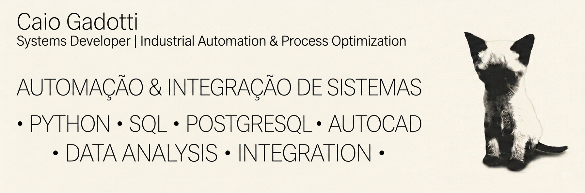

  

# Caio G

**Systems Developer | Industrial Automation & Process Optimization**

[Português](README.md) &nbsp;·&nbsp; **English**

---

## About

I develop integrated systems focused on industrial automation, operational control, and process optimization. My work sits at the intersection of software development and physical operations, building tools that replace manual routines, reduce errors, and give teams real-time visibility over production.

Currently working at Descartee, where I design and maintain internal systems for operational control and workflow automation. Previously at Systra, where I worked on infrastructure projects for the São Paulo Intercity Train (TIC), producing technical drawings and control schematics for catenary systems using AutoCAD.

---

## Skills

**Languages & Frameworks**

**Data & Machine Learning**

**Tools & Integrations**

**Domains**
- Industrial process control
- Hardware-software integration
- Database modeling
- Internal tooling and dashboards

---

## GitHub Stats

  
  

---

## Featured Projects

**Industrial Cut Optimization System** &nbsp;·&nbsp; `process optimization`
Optimization tool for TNT roll cutting operations. Calculates cut sequences to minimize waste, tracks operator performance in real time, and sends automated alerts via Telegram. Built with Python and Streamlit.

**Automated Label Printing** &nbsp;·&nbsp; `hardware integration`
Application for automated label generation and printing with direct integration to Zebra thermal printers. Eliminates manual label creation and reduces errors in labeling workflows.

**HR Admission Portal** &nbsp;·&nbsp; `internal tooling`
Web application for managing employee onboarding. Handles document upload, form validation, and data persistence with role-based access. Built with Streamlit and Supabase.

**AutoCAD Process Automation** &nbsp;·&nbsp; `cad automation`
Scripts and tools for automating repetitive CAD tasks: dynamic layout generation, automated title block population, and batch drawing exports. Developed for infrastructure and industrial environments.

> These run on internal company systems, so their repositories are private.

**[PDF Compressor](https://github.com/caiogadotti/pdf-compressor)** &nbsp;·&nbsp; `desktop tool` &nbsp;·&nbsp; `public` &nbsp;·&nbsp; [download](https://github.com/caiogadotti/pdf-compressor/releases/latest)
Windows desktop app that shrinks scanned PDFs by recompressing their embedded images: downscales to the resolution actually needed for reading and re-encodes as JPEG, instead of just repackaging the file. Cuts 80–99% of the size while keeping text readable. Native drag-and-drop UI with a ready-to-run installer built via Inno Setup. Built with Python, PyMuPDF, Pillow and CustomTkinter.

---

## Featured Projects &nbsp;·&nbsp; Graduation

Coursework from my Machine Learning Lab (LCML), published as open source.

**[Handwritten Digit Recognizer](https://github.com/caiogadotti/reconhecimento-digitos-knn)** &nbsp;·&nbsp; `machine learning` &nbsp;·&nbsp; `public` &nbsp;·&nbsp; [live app](https://reconhecimento-digitos-knn.streamlit.app/)
Machine learning classifier that reads handwritten digits from 8×8 images, with a Streamlit interface to draw a number and see the prediction, the confidence across classes, and the training examples that produced the answer. Reaches **93.4%** on 2,000 digits written by other people and never seen during training.

The interesting part was the diagnosis: training only on the classic `digits` dataset gave 98% on its own test set but 62.5% on handwriting from another source. No model swap or hyperparameter search closed that gap. Adding writing diversity to the training data did, worth +29 points. Built with scikit-learn, NumPy and SciPy.

**[Color-Based Position Detector](https://github.com/caiogadotti/deteccao-cor-cv)** &nbsp;·&nbsp; `computer vision` &nbsp;·&nbsp; `public` &nbsp;·&nbsp; [live app](https://deteccao-cor.streamlit.app/)
Computer vision pipeline that locates a colored object in an image and classifies its position (left, center, right) using classic OpenCV, no machine learning. Converts to HSV, thresholds the target color, finds the largest contour and its centroid, then compares it against the frame's midpoint with a tolerance band. Streamlit interface with live browser camera capture, manual HSV calibration sliders, and a synthetic fallback image for testing without a webcam.

**[Predictive Catenary Monitoring](https://github.com/caiogadotti/monitoramento-catenaria)** &nbsp;·&nbsp; `distributed systems` &nbsp;·&nbsp; `go` &nbsp;·&nbsp; `python` &nbsp;·&nbsp; `public`
End to end predictive maintenance pipeline for railway catenary: a concurrent ingestion gateway in Go receiving telemetry from thousands of simulated sensors, a Python analysis engine estimating structural fatigue damage, Supabase persistence and a Streamlit dashboard. Domain grounded in 6 months at Systra doing technical drawings and control schematics for catenary systems on the São Paulo Intercity Train (TIC). The gateway was measured under real load, not estimated: **2,000 concurrent sensors, zero connection failures**, using a load testing tool written for the project.

The engine estimates wear two independent ways, cycle counting via the Basquin and Palmgren-Miner rules, and spectral analysis via FFT of the vibration signal. The interesting part was finding that their mean error, nearly tied at 0.002, was hiding the one case that mattered: a sensor with **0.652** real damage, one step from the critical threshold, was classified normal and fired no alert. Cycle counting is blind to accelerated wear by construction, since two points under the same load with the same number of passages produce the same count even when degrading at different rates. The spectral estimator got that case right (0.609), and the fix was to take the state from the larger of the two and turn their divergence into an accelerated wear signal. Validated across 150 sensors: it flags exactly the 2% defective ones, with no false positives. Built with Go, NumPy, Supabase and Streamlit.

**[CAD Drawing Autocomplete](https://github.com/caiogadotti/autocomplete-desenho-cad)** &nbsp;·&nbsp; `ai` &nbsp;·&nbsp; `computer vision` &nbsp;·&nbsp; `public`
You draw one side of a piece and it suggests how the piece is likely to finish, comparing against a history of what you've drawn before or against a reference catalog. Reads and writes real DXF, tested round-tripping through FreeCAD, and also extracts pieces from a sketch/photo via classic OpenCV. The idea came from 6 months redrawing pieces similar to ones I'd already made in AutoCAD at Systra: the CAD software already knew what I'd drawn before, it just never suggested anything on its own.

To test it with real numbers, I used fabric-roll cutting as the domain (based on the TNT fabric cutting I see at Descartee): compared nesting heuristics with a strict overlap validator, and one finding contradicted bin-packing textbooks. Minimizing the buried area under each piece, the standard heuristic, fragmented the profile and dropped yield from 89.6% to as low as 68.3%; the simpler "lowest resulting top" rule won by keeping a few wide segments instead of many narrow steps. Built with Python, OpenCV and ezdxf.

---

## Contact

- **LinkedIn:** [linkedin.com/in/caiogadotti](https://linkedin.com/in/caiogadotti)
- **Email:** available on LinkedIn

