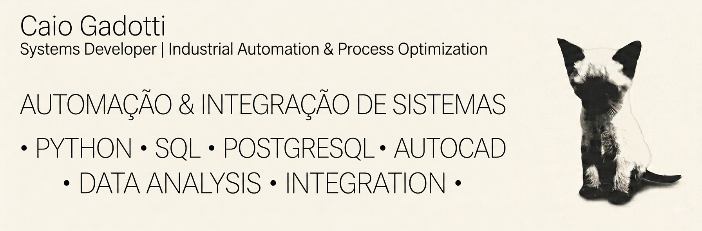

  

# Caio G

**Desenvolvedor de Sistemas | Automação Industrial e Otimização de Processos**

**Português** &nbsp;·&nbsp; [English](README.en.md)

---

## Sobre

Desenvolvo sistemas integrados voltados a automação industrial, controle operacional e otimização de processos. Meu trabalho fica na fronteira entre desenvolvimento de software e operação física, construindo ferramentas que substituem rotinas manuais, reduzem erros e dão às equipes visibilidade em tempo real sobre a produção.

Atualmente na Descartee, onde projeto e mantenho sistemas internos de controle operacional e automação de fluxos de trabalho. Anteriormente na Systra, em projetos de infraestrutura para o Trem Intercidades de São Paulo (TIC), produzindo desenhos técnicos e esquemas de controle para sistemas de catenária em AutoCAD.

---

## Competências

**Linguagens e Frameworks**

**Dados e Aprendizado de Máquina**

**Ferramentas e Integrações**

**Domínios**
- Controle de processos industriais
- Integração hardware-software
- Modelagem de banco de dados
- Ferramentas internas e dashboards

---

## Estatísticas do GitHub

  
  

---

## Projetos em Destaque

**Sistema de Otimização de Corte Industrial** &nbsp;·&nbsp; `otimização de processos`
Ferramenta de otimização para operações de corte de bobinas de TNT. Calcula sequências de corte para minimizar desperdício, acompanha o desempenho dos operadores em tempo real e envia alertas automáticos via Telegram. Feito com Python e Streamlit.

**Impressão Automatizada de Etiquetas** &nbsp;·&nbsp; `integração de hardware`
Aplicação para geração e impressão automatizada de etiquetas com integração direta a impressoras térmicas Zebra. Elimina a criação manual de etiquetas e reduz erros no fluxo de etiquetagem.

**Portal de Admissão de RH** &nbsp;·&nbsp; `ferramenta interna`
Aplicação web para gestão de admissão de funcionários. Trata envio de documentos, validação de formulários e persistência de dados com controle de acesso por perfil. Feito com Streamlit e Supabase.

**Automação de Processos no AutoCAD** &nbsp;·&nbsp; `automação de cad`
Scripts e ferramentas para automatizar tarefas repetitivas de CAD: geração dinâmica de layout, preenchimento automático de carimbos e exportação de desenhos em lote. Desenvolvido para ambientes industriais e de infraestrutura.

> Rodam em sistemas internos da empresa, por isso seus repositórios são privados.

**[PDF Compressor](https://github.com/caiogadotti/pdf-compressor)** &nbsp;·&nbsp; `ferramenta desktop` &nbsp;·&nbsp; `público` &nbsp;·&nbsp; [download](https://github.com/caiogadotti/pdf-compressor/releases/latest)
App desktop para Windows que reduz o tamanho de PDFs escaneados recomprimindo as imagens embutidas: redimensiona pro máximo necessário pra leitura e recodifica em JPEG, em vez de só reempacotar o arquivo. Reduções de 80–99% mantendo legibilidade. Interface com drag-and-drop nativo e instalador pronto via Inno Setup. Feito com Python, PyMuPDF, Pillow e CustomTkinter.

**[Monitoramento Preditivo de Catenária](https://github.com/caiogadotti/monitoramento-catenaria)** &nbsp;·&nbsp; `sistemas distribuídos` &nbsp;·&nbsp; `go` &nbsp;·&nbsp; `python` &nbsp;·&nbsp; `público`
Pipeline completo de manutenção preditiva para catenária ferroviária: gateway de ingestão concorrente em Go recebendo telemetria de milhares de sensores simulados, motor de análise em Python que estima dano por fadiga estrutural, persistência em Supabase e dashboard Streamlit. Domínio baseado em 6 meses na Systra fazendo desenhos técnicos e esquemas de controle de sistemas de catenária no Trem Intercidades de São Paulo (TIC). O gateway foi medido sob carga real, não estimado: **2.000 sensores simultâneos, zero falhas de conexão**, com uma ferramenta de teste de carga escrita para o projeto.

O motor estima o desgaste de duas formas independentes, contagem de ciclos pelas regras de Basquin e Palmgren-Miner, e análise espectral por FFT do sinal de vibração. A parte interessante foi descobrir que o erro médio das duas, quase empatado em 0,002, escondia o único caso que importava: um sensor com dano real de **0,652**, a um passo do limiar crítico, era classificado como normal e não disparava alerta. A contagem de ciclos é cega para desgaste acelerado por construção, já que dois pontos com a mesma carga e o mesmo número de passagens produzem a mesma contagem mesmo se degradando em ritmos diferentes. O estimador espectral acertava esse caso (0,609), e a correção foi tirar o estado do maior dos dois e transformar a divergência entre eles em sinal de desgaste acelerado. Validado em 150 sensores: sinaliza exatamente os 2% defeituosos, sem falso positivo. Feito com Go, NumPy, Supabase e Streamlit.

**[Autocomplete de Desenho para CAD](https://github.com/caiogadotti/autocomplete-desenho-cad)** &nbsp;·&nbsp; `ia` &nbsp;·&nbsp; `visão computacional` &nbsp;·&nbsp; `público`
Você desenha um lado de uma peça e o sistema sugere como ela provavelmente termina, comparando com um histórico do que você já desenhou ou com um catálogo de referência. Lê e escreve DXF real, testado indo e voltando pelo FreeCAD, e também extrai peça de rascunho/foto via OpenCV clássico. A ideia nasceu de 6 meses redesenhando peça parecida com outra em AutoCAD na Systra: o CAD já sabia o que eu tinha desenhado antes, só faltava ele sugerir sozinho.

Pra testar com número de verdade, usei o corte de rolo de tecido como domínio (baseado no que vejo de corte de TNT na Descartee): comparei heurísticas de nesting com um validador estrito de sobreposição, e um achado contradisse a literatura clássica de bin packing. Minimizar a área enterrada sob cada peça, a heurística padrão, fragmentava o perfil e derrubava o aproveitamento de 89,6% pra até 68,3%; a regra mais simples de "menor topo resultante" venceu por manter poucos segmentos largos em vez de muitos degraus estreitos. Feito com Python, OpenCV e ezdxf.

**[Linha de Produção · Digital Twin](https://github.com/caiogadotti/linha-producao-digital-twin)** &nbsp;·&nbsp; `simulação de eventos discretos` &nbsp;·&nbsp; `público`
Simulador de uma linha de produção em série, peça por peça, com tempos de ciclo aleatórios, quebras de máquina e buffers limitados entre estações. Num painel Streamlit dá para editar a fábrica numa tabela e ver onde cada máquina gasta o tempo (trabalhando, quebrada, bloqueada, ociosa), testar onde comprar a próxima máquina e medir quanto a variabilidade custa: com a linha padrão, aumentar a variação do tempo de ciclo tira **14%** da produção, e **34%** sem buffers. O simulador foi validado contra as fórmulas das filas M/M/1 e M/M/c, com erro médio de 1,5%. Feito com SimPy, Plotly e pytest.

**[Despacho de Energia da Fábrica](https://github.com/caiogadotti/despacho-energia-fabrica)** &nbsp;·&nbsp; `otimização e finanças` &nbsp;·&nbsp; `público`
Otimizador que decide em que horário ligar cada carga de uma fábrica (forno, compressor, carregadores de empilhadeira), quando usar a bateria e quanto do solar consumir, com tarifa horo-sazonal e cobrança por pico de demanda. É um problema de programação linear inteira mista resolvido com HiGHS. Na fábrica de exemplo o custo do dia cai **36%** e o pico de demanda vai de 325 para 150 kW; só mudar os horários já entrega 69% disso, sem investimento. O painel ainda sorteia dias de sol por Monte Carlo para medir o valor de uma previsão perfeita e calcula VPL, TIR e o preço em que a bateria passa a se pagar. Validado contra força bruta. Feito com SciPy, Streamlit e Plotly.

**[edgelog · Logger de Telemetria em Rust](https://github.com/caiogadotti/edge-logger-rust)** &nbsp;·&nbsp; `sistemas de baixo nível` &nbsp;·&nbsp; `rust` &nbsp;·&nbsp; `público`
Logger de linha de comando para o computador do lado da máquina: recebe leituras de sensores (simulador, MQTT ou stdin) e grava num formato próprio que aguenta o PC desligar no meio da escrita. Toda leitura passa primeiro por um write-ahead log com CRC e fsync a cada 100 ms; ao religar, o log é cortado no último registro íntegro e o resto é aproveitado. Os blocos guardam cada sensor em colunas, com delta-of-delta no tempo, XOR no valor e zstd por cima. Medido num notebook: **5,3 milhões de leituras/s** com fsync ligado e arquivo **9,6x** menor que CSV. O teste que mais importa mata o processo três vezes no meio da gravação e confere 0 blocos corrompidos; outro corta o log em cada byte possível. Meu primeiro projeto em Rust, com CI em Linux e Windows.

---

## Projetos em Destaque &nbsp;·&nbsp; Graduação

Trabalhos da graduação em Engenharia de Sistemas Ciberfísicos, publicados como open source.

**[BMS para Células LiFePO4](https://github.com/caiogadotti/bms-lifepo4)** &nbsp;·&nbsp; `sistemas embarcados` &nbsp;·&nbsp; `estimação de estado` &nbsp;·&nbsp; `público`
Simulação de um sistema de gerenciamento de bateria para um pack de quatro células LiFePO4: bateria virtual com circuito equivalente 2RC e histerese de Plett, sensores com ruído e offset, filtros passa-baixa, proteção com debounce e um filtro de Kalman estendido estimando o estado de carga de cada célula. A versão original foi feita em MATLAB/Simulink; esta reimplementa o modelo em Python com um painel interativo. O resultado central: como a curva do LFP é muito plana, um estimador que ignora os 18 mV de histerese passa de **0,4%** para **7,0%** de erro de SOC, com pico de 13,6%. Feito com NumPy, Streamlit e Plotly, com 14 testes.

**[Manutenção Preditiva com Probabilidade](https://github.com/caiogadotti/manutencao-preditiva-probabilidade)** &nbsp;·&nbsp; `probabilidade e estatística` &nbsp;·&nbsp; `público`
Painel Streamlit que aplica probabilidade a um sistema ciberfísico de manutenção, com sensores de vibração e temperatura e alarmes que erram. Cada aba cobre uma parte da matéria (Bayes, Binomial, Poisson, Exponencial, Normal, distribuição conjunta e combinação de normais) e compara a fórmula com 100 mil simulações Monte Carlo. O resultado que mais chama atenção: com um sensor que acerta 95%, só **28%** dos alarmes são falha real. Feito com NumPy e SciPy.

**[Reconhecedor de Dígitos Manuscritos](https://github.com/caiogadotti/reconhecimento-digitos-knn)** &nbsp;·&nbsp; `aprendizado de máquina` &nbsp;·&nbsp; `público` &nbsp;·&nbsp; [app online](https://reconhecimento-digitos-knn.streamlit.app/)
Classificador de aprendizado de máquina que lê dígitos manuscritos a partir de imagens 8×8, com interface Streamlit para desenhar um número e ver a previsão, a confiança entre as classes e os exemplos de treino que produziram a resposta. Alcança **93,4%** em 2.000 dígitos escritos por outras pessoas e nunca vistos durante o treino.

A parte interessante foi o diagnóstico: treinar apenas com o dataset clássico `digits` dava 98% no próprio conjunto de teste, mas 62,5% em caligrafia de outra origem. Nenhuma troca de modelo ou busca de hiperparâmetro fechou essa lacuna. Quem fechou foi acrescentar diversidade de escrita aos dados de treino, valendo +29 pontos. Feito com scikit-learn, NumPy e SciPy.

**[Detector de Posição por Cor](https://github.com/caiogadotti/deteccao-cor-cv)** &nbsp;·&nbsp; `visão computacional` &nbsp;·&nbsp; `público` &nbsp;·&nbsp; [app online](https://deteccao-cor.streamlit.app/)
Pipeline de visão computacional que localiza um objeto colorido numa imagem e classifica sua posição (esquerda, centro, direita) usando OpenCV clássico, sem aprendizado de máquina. Converte para HSV, isola a cor-alvo, encontra o maior contorno e seu centroide, e compara com o meio da imagem usando uma margem de tolerância. Interface Streamlit com captura de câmera pelo navegador, calibração manual de HSV por sliders e uma imagem sintética de fallback para testar sem webcam.

**[Árvores de Decisão: Iris e Sensor de Triagem](https://github.com/caiogadotti/arvore-decisao-iris)** &nbsp;·&nbsp; `aprendizado de máquina` &nbsp;·&nbsp; `público`
Duas entregas da Aula 3 do LCML no mesmo repositório. A primeira treina uma árvore de decisão pra classificar flores Iris em três espécies a partir de quatro medidas, mostrando cada pergunta que a árvore fez, nó por nó, até a resposta. A segunda é um dataset autoral meu: um sensor de esteira que separa papel, plástico e metal por peso, densidade, condutividade e opacidade, com uma interface de arrastar um item até o sensor e ver a classificação rodar na hora.

A árvore do desafio autoral chega a **97,4%** no treino e **92,3%** no teste usando só duas leituras: condutividade separa metal do resto, opacidade separa papel de plástico. A zona de arrastar e soltar roda a mesma árvore duas vezes, uma em Python pra treinar, e a estrutura de nós serializada em JSON e reexecutada em JavaScript no navegador, pra classificar cada item solto no sensor sem round-trip com o servidor.

**[Rede Neural para Dígitos Manuscritos](https://github.com/caiogadotti/reconhecimento-digitos-mlp)** &nbsp;·&nbsp; `aprendizado de máquina` &nbsp;·&nbsp; `público`
Rede neural (MLP) treinada no mesmo dataset de dígitos manuscritos da Aula 2, comparada lado a lado com o k-NN, com um dashboard Streamlit que reexecuta o pipeline completo: curva de perda, matriz de confusão e o desafio autoral.

Testei o modelo contra cinco dígitos escritos à mão gerados por IA, fora do estilo do dataset de treino. A acurácia caiu de 96% pra 20%, e nem trocar o método de recorte (limiar fixo por Otsu) resolveu: comparando os histogramas de intensidade de pixel, o dataset original vem quase binarizado (traço e fundo bem definidos), enquanto as fotos geradas por IA têm sombra e antialiasing que a rede nunca viu no treino. Feito com scikit-learn, scikit-image e Streamlit.

---

## Contato

- **LinkedIn:** [linkedin.com/in/caiogadotti](https://www.linkedin.com/in/caio-gadotti-973673257/)
- **E-mail:** disponível no LinkedIn
